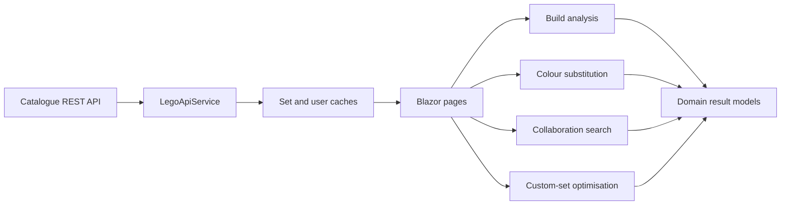

# LEGO Builder Catalogue

A Blazor application that compares LEGO set requirements with user inventories. It answers the original challenge—“Which sets can this user build?”—and extends it with collaboration, whole-colour substitution, and custom-set generation.

This document is written as both a technical overview and a set of presentation notes.

## What the application does

The application supports four related use cases:

1. **Direct build analysis**  
   Determines which catalogue sets a selected user can build exactly and reports every missing piece.

2. **Collaboration**  
   Finds minimal combinations of other users whose combined inventories cover the selected user's deficits.

3. **Colour substitution**  
   Finds additional sets that become buildable when complete colour groups may be reassigned to distinct colours.

4. **Custom-set generation**  
   Produces the largest common set specification that:
   - at least a configurable percentage of users can build; and
   - every explicitly selected target user can build.

## Architecture

The solution is a .NET 11 Blazor Web App with Interactive Auto rendering. It supports both interactive server rendering and WebAssembly.



The design separates responsibilities:

- **API services** retrieve and cache remote data.
- **InventoryBuilder** converts API collections into dictionaries suited to each algorithm.
- **Domain services** are stateless and contain the decision logic.
- **Blazor pages and components** coordinate data loading and display results.
- **Tests** exercise the algorithms independently of the UI.

The external API documentation is available at [d30r5p5favh3z8.cloudfront.net](https://d30r5p5favh3z8.cloudfront.net/).

## Domain model

A physical piece is identified by two values:

- `designId`: the shape of the piece;
- `colorCode`: its colour/material.

The pair `(designId, colorCode)` is therefore the inventory key. Quantities are never shared between different colours.

The application mainly uses two inventory representations:

- `Dictionary<(designId, colorCode), count>` for deficit and coverage calculations;
- `Dictionary<designId, Dictionary<colorCode, count>>` for fast colour-specific lookups.

Both representations make the common inventory lookup effectively constant time.

## Data flow

When a user is selected, the home page:

1. fetches the user's full inventory;
2. fetches the set catalogue;
3. fetches each set's detailed piece requirements;
4. runs exact build analysis for every set;
5. runs colour-substitution analysis for sets that are not directly buildable;
6. loads other users only if collaboration analysis is requested.

Set summaries, set details, and user inventories are cached. A manual refresh can bypass the caches when current API data is required.

## Algorithms

| Feature | Main technique | Guarantee |
|---|---|---|
| Direct build | Exact dictionary lookup | Exact answer |
| Collaboration | Exhaustive subset coverage | Every inclusion-minimal combination within the candidate cap |
| Colour substitution | Backtracking assignment | Exact answer for the available colour candidates |
| Custom set, ≤20 users | Combination enumeration | Globally best specification under the scoring rule |
| Custom set, >20 users | Greedy group construction | Feasible specification, not necessarily globally best |

### 1. Direct build analysis

For every requirement in a set, the service looks up the user's quantity for the exact `(designId, colorCode)` pair.

```text
if owned quantity < required quantity:
    record the deficit

set is buildable when no deficits remain
```

This algorithm is deliberately strict: owning the correct shape in another colour does not satisfy the normal build requirement.

**Complexity:** approximately `O(I + P)`, where `I` is the inventory size and `P` is the number of set requirement rows.

Implementation: [`BuildAnalysisService`](LegoChallenge.Client/Services/BuildAnalysisService.cs)

### 2. Collaboration search

Collaboration starts from the primary user's deficits, not from the complete set. This keeps the search focused on pieces that still matter.

For each candidate user, the service calculates:

```text
coverage(piece) = min(candidate owns, amount still missing)
```

The UI uses an exhaustive bitmask search:

1. discard users who cannot contribute any missing piece;
2. enumerate every subset of the remaining candidates;
3. retain subsets whose combined coverage fills all deficits;
4. remove any subset that contains a smaller covering subset;
5. allocate contributions sequentially so shared pieces are not double-counted.

The result contains every **minimal** combination: removing any collaborator would make that combination incomplete. “Minimal” is not the same as “minimum”; combinations can have different sizes, but none contains a redundant user.

The candidate pool is capped at 24 because subset enumeration grows exponentially.

Coverage enumeration costs `O(2^N × N × D)`, where `N` is the number of contributing candidates and `D` is the number of deficit types. If `M` subsets cover the deficit, the final minimality filter is `O(M²)` in the worst case.

The service also contains a greedy minimum-collaborator approximation and a method that lists all individual contributors, although the current UI presents the exhaustive minimal combinations.

Implementation: [`CollaborationService`](LegoChallenge.Client/Services/CollaborationService.cs)

### 3. Whole-colour substitution

The substitution rule applies to an entire colour group. If a set's white group contains ten different designs, every one of those designs must be available in the replacement colour and in the required quantity.

The algorithm:

1. groups all set requirements by original colour;
2. identifies colour groups that cannot be built in their original colour;
3. calculates every valid substitute colour for each group;
4. uses backtracking to assign one distinct substitute to every group that must move;
5. backtracks when two groups compete for the same target colour.

The assignment is one-to-one because a replacement colour cannot be used elsewhere in the resulting set.

An important edge case is using a colour that originally belongs to another group. This is allowed only if that other group also moves. For example:

```text
white walls  -> red
red roof     -> blue
green flag   -> green
```

When the solver assigns an existing set colour, it dynamically adds that colour's original group to the work list. This supports swaps and longer reassignment chains while preserving the uniqueness rule.

This is a small constraint-satisfaction problem similar to bipartite matching. Backtracking is appropriate because sets contain relatively few colour groups, even when they contain many pieces.

**Worst-case complexity:** exponential in the number of colour groups. Candidate validation itself is linear in the pieces within each group.

Implementation: [`ColorSubstitutionService`](LegoChallenge.Client/Services/ColorSubstitutionService.cs)

### 4. Custom-set optimisation

The custom-set builder accepts:

- all available users;
- a target percentage from 1 to 100, defaulting to 50%;
- zero or more required user IDs.

The number of qualifying users is:

```text
qualifyingCount =
    max(ceil(totalUsers × targetPercentage / 100),
        requiredUserCount)
```

This means selected users are always guaranteed to build the result, even when more users are selected than the percentage alone would require.

#### Building a specification for one group

For a chosen group of qualifying users, the generated specification is their inventory intersection:

- include only `(designId, colorCode)` pairs owned by every group member;
- use the minimum quantity owned by any group member.

For example, if three users own 10, 7, and 4 blue plates, the generated set may require at most 4 blue plates.

This construction gives a direct correctness guarantee: every user in the chosen group can build the result.

#### Choosing the best group

For up to 20 users, the service examines every qualifying group that contains all required users.

Candidate specifications are ranked by:

1. most distinct `(designId, colorCode)` types;
2. highest total quantity as a tie-breaker.

Required users reduce the search space because only optional positions need to be combined.

If there are `n` users, `r` required users, and `k` qualifying users, the exact search considers:

```text
C(n - r, k - r)
```

groups.

For more than 20 users, exhaustive search may become impractical. The service switches to a greedy strategy:

1. begin with all required users;
2. repeatedly add the user who preserves the largest current intersection;
3. stop after the qualifying count is reached.

The greedy path always returns a feasible result, but it is not guaranteed to find the globally largest specification. This is an explicit scalability tradeoff.

Implementation: [`CustomSetService`](LegoChallenge.Client/Services/CustomSetService.cs)  
UI: [`CustomSetBuilder`](LegoChallenge.Client/Pages/CustomSetBuilder.razor)

## Correctness rules and invariants

The core algorithms maintain these invariants:

- A normal build uses exact design and colour matches.
- Missing quantities are calculated independently for each inventory key.
- Collaborators contribute no more than they own or the amount still needed.
- Every substituted colour covers the complete original colour group.
- Two original colour groups never share one resulting colour.
- Every required custom-set user belongs to the qualifying group.
- Every custom-set quantity is no greater than the minimum held by its qualifying users.

These invariants make the returned results explainable: the UI can show the exact deficits, contributions, substitutions, and generated quantities behind each decision.

## Testing and verification

The automated suite contains 49 tests across:

- direct build matching and deficit reporting;
- collaboration coverage and minimal combinations;
- single substitutions, swaps, reassignment chains, collisions, and backtracking;
- custom thresholds, mandatory users, invalid input, and the large-user greedy path.

Run the suite with:

```powershell
dotnet test LegoChallenge.Tests\LegoChallenge.Tests.csproj
```

The colour-substitution implementation was also manually compared with an independent full-assignment solver against every live catalogue set for `dr_crocodile`. Both approaches identified `coffee-bar` as the only additional buildable set. A further generated comparison of 20,000 inventories found no disagreement.

## Running the application

Prerequisite: the .NET 11 preview SDK used by the project.

```powershell
dotnet run --project LegoChallenge
```

Then use:

- **Home** to select a user, inspect buildable sets, substitutions, and collaboration options;
- **Custom Set** to choose a percentage threshold, select mandatory users, and generate a shared specification.

The application depends on the hosted catalogue API and therefore requires network access.

## Suggested presentation flow

A concise presentation can follow this sequence:

1. **Problem and model**  
   Explain that a piece is a design-and-colour pair with a quantity.

2. **Architecture**  
   Show the separation between API access, inventory indexes, domain algorithms, and Blazor UI.

3. **Baseline result**  
   Demonstrate exact build matching and a missing-pieces explanation.

4. **Hard algorithm**  
   Open a colour-substitution result and explain whole-group candidates, unique colours, and backtracking.

5. **Collaboration**  
   Show that the search works from deficits and returns combinations without redundant users.

6. **Custom builder**  
   Change the threshold, select mandatory users, and explain inventory intersection plus exact/greedy group selection.

7. **Engineering tradeoffs**  
   Close with exponential search boundaries, caching, test coverage, and possible future improvements.

## Tradeoffs and future improvements

- **Branch-and-bound custom-set search:** extend exact optimisation beyond 20 users without enumerating every group.
- **Deterministic tie-breaking:** add stable secondary keys when two generated sets have identical scores.
- **Parallel or bounded-concurrency loading:** reduce initial latency while protecting the external API.
- **Cancellation support:** allow long collaboration or custom-set searches to be stopped.
- **Aggregate duplicate set rows:** explicitly combine repeated `(designId, colorCode)` requirements before analysis. The current API data uses unique rows, but aggregation would make that assumption explicit.
- **Persistent cache and resilience:** add expiration, retries, and offline handling around the remote API.
- **Authentication:** the current user selector models catalogue users; it is not an authentication system.

## Project map

```text
LegoChallenge/                 ASP.NET Core host
LegoChallenge.Client/
  Models/                      API and result records
  Pages/                       Home and custom-set UI
  Components/                  Reusable set-result presentation
  Services/                    API, caching, and algorithms
LegoChallenge.Tests/           Unit tests and test builders
```
